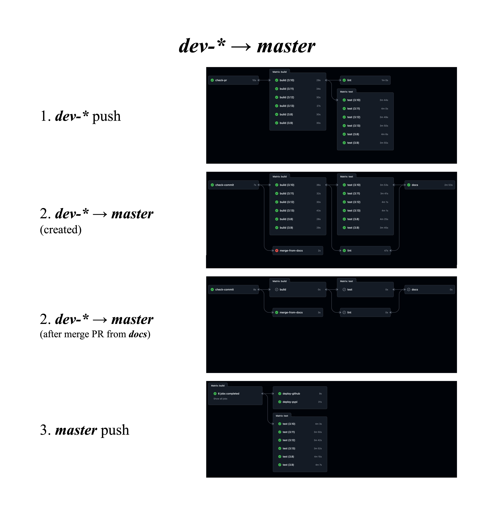
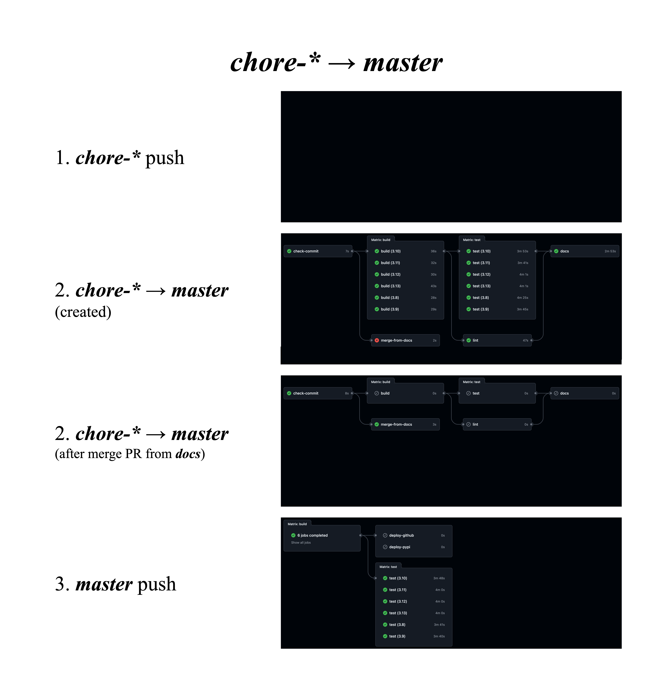
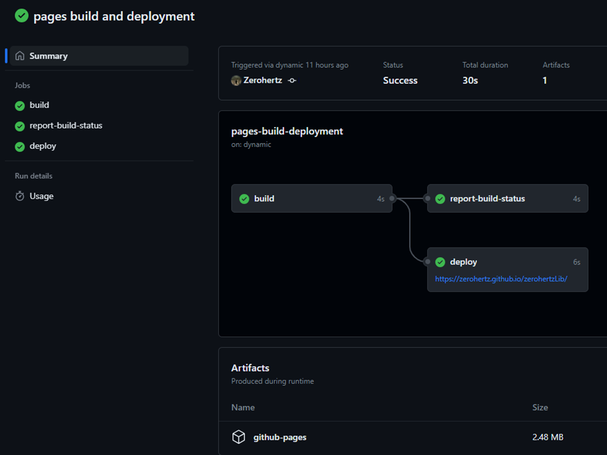
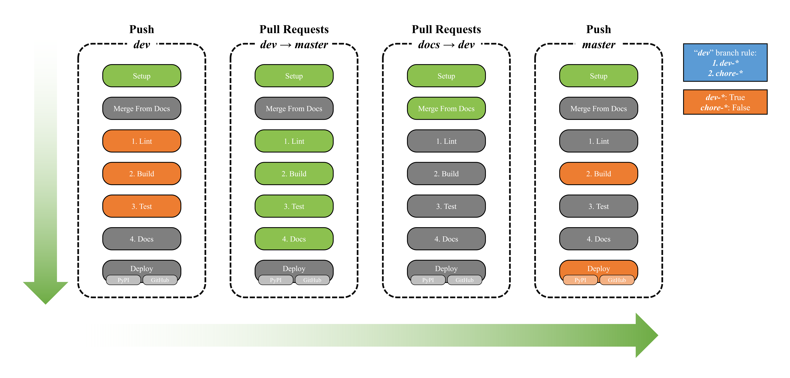
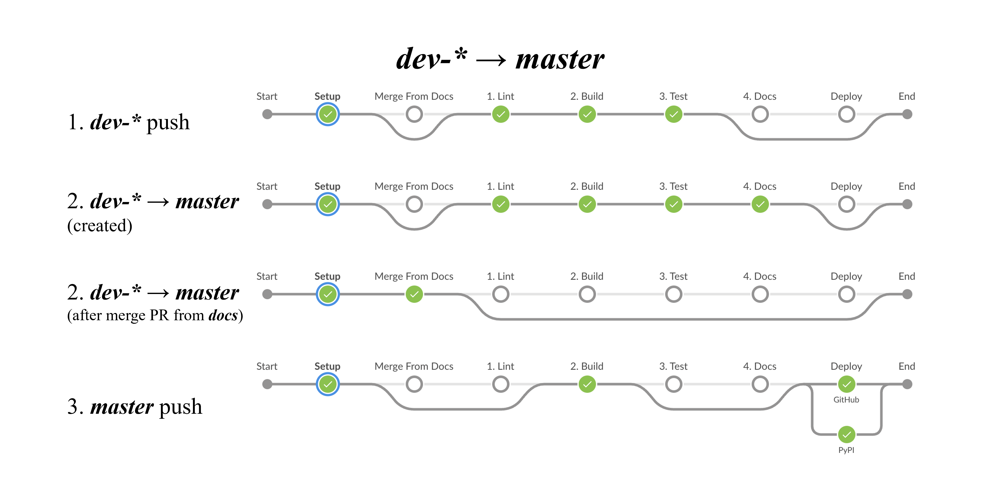
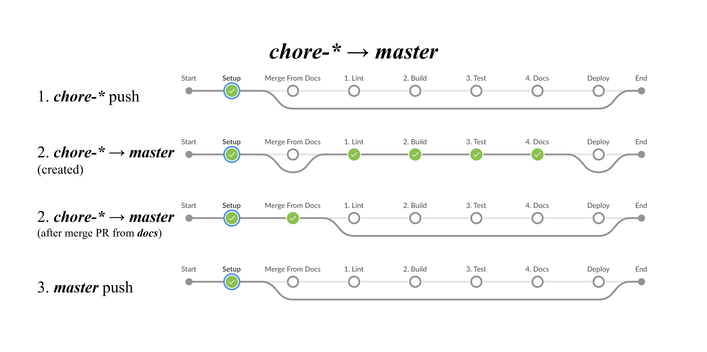

---
hide:
  - navigation
---

# CI/CD Pipelines

!!! important "Used Stacks"
    GitHub Actions (Ruff, Setuptools, PyTest, Codecov) & Read the Docs (MkDocs)

## Branch Rules

### Dev Branch

!!! note "Branch Rule"
    The `dev` branch is used when there are functional changes resulting in different build outcomes.

   

1. `dev-*` push
    1. `check-pr`: Check if a PR is open for the `dev-*` branch
    2. `build`: Install dependencies & build package
    3. `lint`: Format and lint Python code with Ruff
    4. `test`: Do PyTest
2. `dev-*` → `master`
    1. `check-commit`: Commit message parsing
    2. `build`: Install dependencies & build package
    3. `lint`: Format and lint Python code with Ruff
    4. `test`: Do PyTest
    5. `docs`: Create PR (`docs` → `dev-*`) including the build results generated by Sphinx
    6. `merge-from-docs`: If merge PR from `docs`, can merge `dev-*` → `master`
3. `master` push
    1. `build`: Install dependencies & build package
    2. `test`: Do PyTest
    3. `deploy`
        1. `GitHub`: Deploy to GitHub
        2. `PyPI`: Deploy to PyPI

### Chore Branch

!!! note "Branch Rule"
    The `chore` branch is utilized when the build result is not different, but there are changes in the CI/CD pipeline or documentation.

   

1. `chore-*` push
2. `chore-*` → `master`
    1. `check-commit`: Commit message parsing
    2. `build`: Install dependencies & build package
    3. `lint`: Format and lint Python code with Ruff
    4. `test`: Do PyTest
    5. `docs`: Create PR (`docs` → `dev-*`) including the build results generated by Sphinx
    6. `merge-from-docs`: If merge PR from `docs`, can merge `dev-*` → `master`
3. `master` push
    1. `build`: Install dependencies & build package
    2. `test`: Do PyTest

## Managing Labels for Issues and Pull Requests in GitHub

- [Issue](https://github.com/Zerohertz/zerohertzLib/blob/master/.github/workflows/issue-controller.yaml)
    - `assignees: ['Zerohertz']`
    - `contains(github.event.issue.title, '[Bug]')` → `labels: ['fix']`
    - `contains(github.event.issue.title, '[Chore]')` → `labels: ['chore']`
    - `contains(github.event.issue.title, '[Style]')` → `labels: ['style']`
    - `contains(github.event.issue.title, '[Docs]')` → `labels: ['docs']`
- [Pull Request](https://github.com/Zerohertz/zerohertzLib/blob/master/.github/workflows/pr-controller.yaml)
    - `assignees: ['Zerohertz']`
    - `body.includes('bug') || body.includes('fix') || body.includes('수정')` → `labelsToAdd.push('fix')`
    - `body.includes('style')` → `labelsToAdd.push('style')`
    - `baseBranch === 'master' && headBranch.startsWith('dev')`
        - `labelsToAdd.push('release')`
        - `(file.filename.startsWith('Jenkins') || file.filename.startsWith('.github/workflows'))` → `labelsToAdd.push('chore')`
        - `(file.filename.startsWith('sphinx') && !file.filename.includes('release'))` → `labelsToAdd.push('docs')`
        - `(file.filename.startsWith('zerohertzLib/{MODULE_NAME}/__init__') || body.includes('{MODULE_NAME}'))` → `labelsToAdd.push('feat/{MODULE_NAME}')`
    - `baseBranch === 'master' && headBranch.startsWith('chore')`
        - `labelsToAdd.push('release/chore')`
        - `(file.filename.startsWith('Jenkins') || file.filename.startsWith('.github/workflows'))` → `labelsToAdd.push('chore')`
        - `(file.filename.startsWith('sphinx') && !file.filename.includes('release'))` → `labelsToAdd.push('docs')`
    - `baseBranch.startsWith('dev') || baseBranch.startsWith('chore')) && headBranch === 'docs'`
        - `labelsToAdd.push('docs')`

## MkDocs Documentation Deployment

!!! note "MkDocs Documentation"
    Documents created and built using MkDocs are deployed via GitHub Actions and GitHub Pages

   

---

??? note "Jenkins (Deprecated)"
    !!! important "Used Stacks"
        Jenkins (Black, flake8, Pylint, Setuptools, PyTest, Sphinx)

    

        
    

    ## Jenkins

    

    |        Stage         | Condition                                                                                                                                                                                                 |
    | :------------------: | --------------------------------------------------------------------------------------------------------------------------------------------------------------------------------------------------------- |
    |      1. `Setup`      | ⭕ [`*` Push]                                                                                                                                                                                             |
    | 2. `Merge From Docs` | ⭕ [`*` Push] "Merge pull request\*/docs" ⭕ [`*` Push] "Merge pull request\*[Docs] Build by Sphinx for GitHub Pages"                                                                                 |
    |     3. `1. Lint`     | ⭕ [`dev*` Push] ⭕ [`master` PR] (Except "Merge pull request\*/docs" && "Merge pull request\*[Docs] Build by Sphinx for GitHub Pages")                                                                |
    |    4. `2. Build`     | ⭕ [`master` Push] (Except "Merge pull request\*/chore\*") ⭕ [`dev*` Push] ⭕ [`master` PR] (Except "Merge pull request\*/docs" && "Merge pull request\*[Docs] Build by Sphinx for GitHub Pages") |
    |     5. `3. Test`     | ⭕ [`dev*` Push] ⭕ [`master` PR] (Except "Merge pull request\*/docs" && "Merge pull request\*[Docs] Build by Sphinx for GitHub Pages")                                                                |
    |     6. `4. Docs`     | ⭕ [`master` PR] (Except "Merge pull request\*/docs" && "Merge pull request\*[Docs] Build by Sphinx for GitHub Pages")                                                                                    |
    |     7. `Deploy`      | ⭕ [`master` Push] "Merge pull request\*from Zerohertz/dev\*" (Except "\*from Zerohertz/chore\*")                                                                                                         |

    

    ### Dev Branch

    !!! note "Branch Rule"
        The `dev` branch is used when there are functional changes resulting in different build outcomes.

    

    
    

    1. `dev-*` push
        1. `Setup`: Commit message parsing
        2. `1. Lint`: Check format of python codes
        3. `2. Build`: Install dependencies & build package
        4. `3. Test`: Do PyTest
    2. `dev-*` → `master`
        1. `Setup`: Commit message parsing
        2. `1. Lint`: Check format of python codes
        3. `2. Build`: Install dependencies & build package
        4. `3. Test`: Do PyTest
        5. `4. Docs`: Create PR (`docs` → `dev-*`) including the build results generated by Sphinx
        6. `Merge From Docs`: If merge PR from `docs`, can merge `dev-*` → `master`
    3. `master` push
        1. `Setup`: Commit message parsing
        2. `2. Build`: Install dependencies & build package
        3. `Deploy`
            1. `GitHub`: Deploy to GitHub
            2. `PyPI`: Deploy to PyPI

    ### Chore Branch

    !!! note "Branch Rule"
        The `chore` branch is utilized when the build result is not different, but there are changes in the CI/CD pipeline or documentation.

    

    
    

    1. `chore-*` push
        1. `Setup`: Commit message parsing
    2. `chore-*` → `master`
        1. `Setup`: Commit message parsing
        2. `1. Lint`: Check format of python codes
        3. `2. Build`: Install dependencies & build package
        4. `3. Test`: Do PyTest
        5. `4. Docs`: Create PR (`docs` → `chore-*`) including the build results generated by Sphinx
        6. `Merge From Docs`: If merge PR from `docs`, can merge `chore-*` → `master`
    3. `master` push
        1. `Setup`: Commit message parsing
